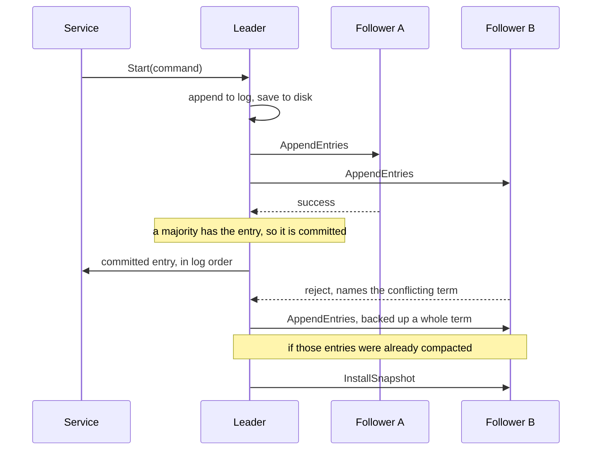

# Concord

Raft consensus in Go.

Raft is how a group of servers agrees on a single ordered log even when some of them crash or
lose contact. One server is elected leader. It takes new entries, sends them to the others, and
marks an entry committed once a majority has it. If the leader dies, the rest elect a new one and
carry on without losing anything that was committed.

This covers leader election, log replication, persistence and snapshots. It follows Figure 2 of
the Raft paper, including the two rules people usually get wrong. A leader only commits entries
from its own term by counting replicas. A follower that rejects an append tells the leader which
term conflicted, so the leader backs up a whole term at a time instead of one entry.



## Tests

The test harness runs each server as its own process and talks to them over RPC. The tests kill
servers, cut the network, drop and reorder messages, and check that the log never disagrees.

The 13 election and replication tests pass 50 runs in a row with Go's race detector on. The 15
persistence and snapshot tests, which crash and restart servers and cut the log short, pass with
it on as well.

```
go test -race
```

## Running it

The test harness is a separate package and is not included here. `raft.go` drops into it as the
`raft1` package.
